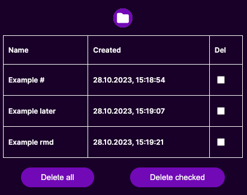

# TabRemind
Chrome extension for those who save a lot of tabs and never open them again
  

## Quick note before you start
Please don't get confused with terminology, tabs and bookmarks are the same thing. Chrome just refers to saved tabs as bookmarks 😅
## Instalation
- Download ZIP file and unzip it
- Go to `chrome://extensions/` in chrome
- Turn developer mode on (right top corner)
- Click <b>"Load unpacked"</b> button
- Select unzipped folder
- Once it's installed, browser should automatically enable the extension
- It's done!
## Usage
I decided to use one of the three strings that I've chosen to mark your tabs. Use either `#`, `later` or `rmd` (remind for short).
## Now, you won't have to worry, that you'll forget about a bookmark 😎
